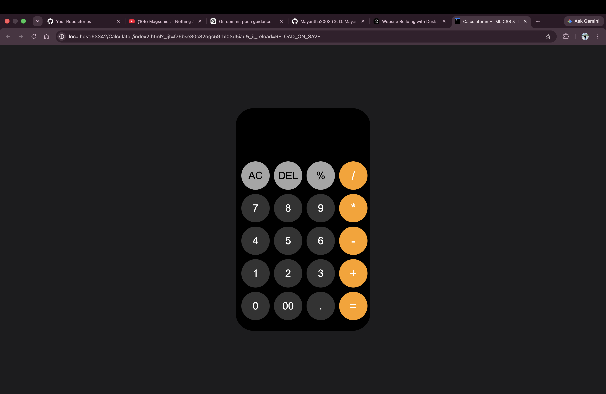
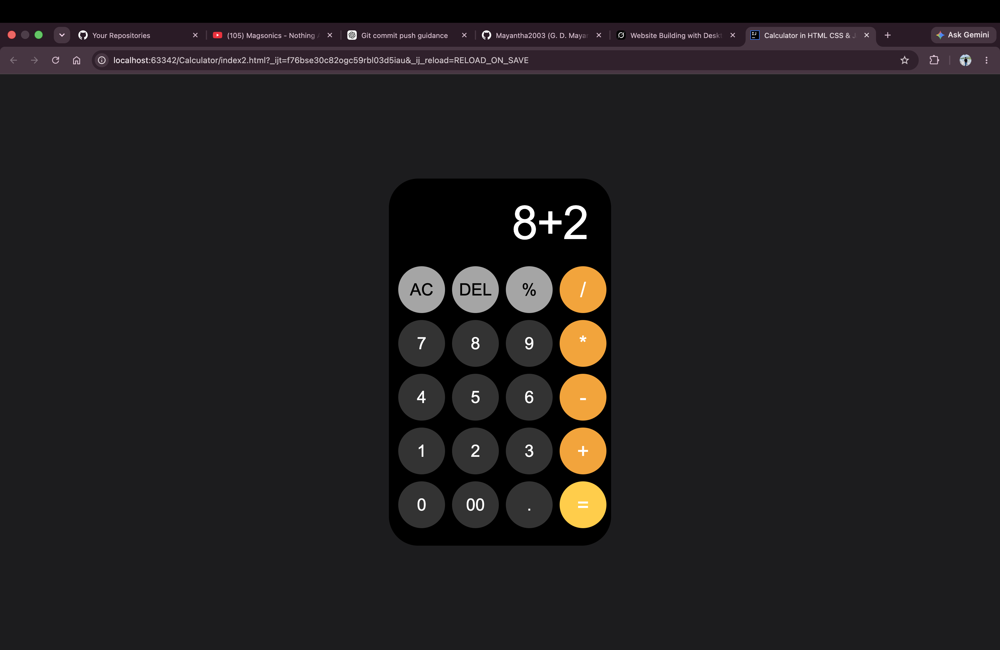
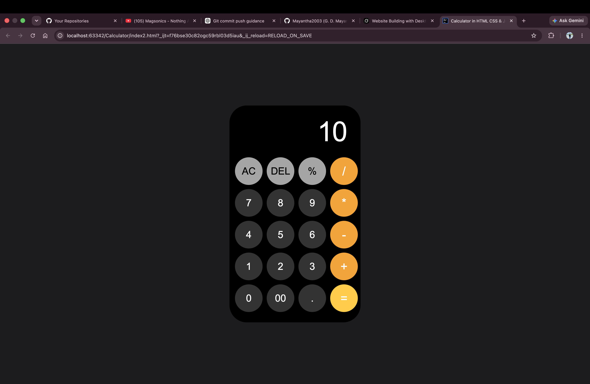

# Calculator – HTML, CSS & JavaScript

A clean, modern **web calculator** inspired by the iOS design.  
Built with pure **HTML**, **CSS**, and **vanilla JavaScript** — no frameworks.

---

## Features

- Basic arithmetic: `+` `-` `*` `/`
- Percentage (`%`)
- Clear all (`AC`) and delete last character (`DEL`)
- Decimal point and double-zero (`00`)
- Live expression display
- Rounded dark UI with orange operator buttons
- Hover / active button feedback

---

## Screenshots

### Idle


### Expression


### Result


---

## Tech Stack

| Technology | Usage |
|------------|--------|
| HTML5 | Structure |
| CSS3 | Layout, colors, hover effects |
| JavaScript | Button logic & calculations |

---

## How to Run

```bash
# Open in browser
open index2.html
```

Or use **Live Server** / any static file server.

---

## Controls

| Button | Action |
|--------|--------|
| `0–9` | Append digit |
| `00` | Append double zero |
| `.` | Decimal point |
| `+ − * /` | Operators |
| `%` | Percentage |
| `=` | Evaluate expression |
| `AC` | Clear everything |
| `DEL` | Delete last character |

---

## Project Structure

```
Calculator/
├── index2.html      # Full app (HTML + CSS + JS)
├── screenshots/
└── README.md
```

---

## Author

**G. D. Mayantha (Mayantha Sithum Kaveesha)**  
GitHub: [Mayantha2003](https://github.com/Mayantha2003)

---

## License

Educational / portfolio project.
